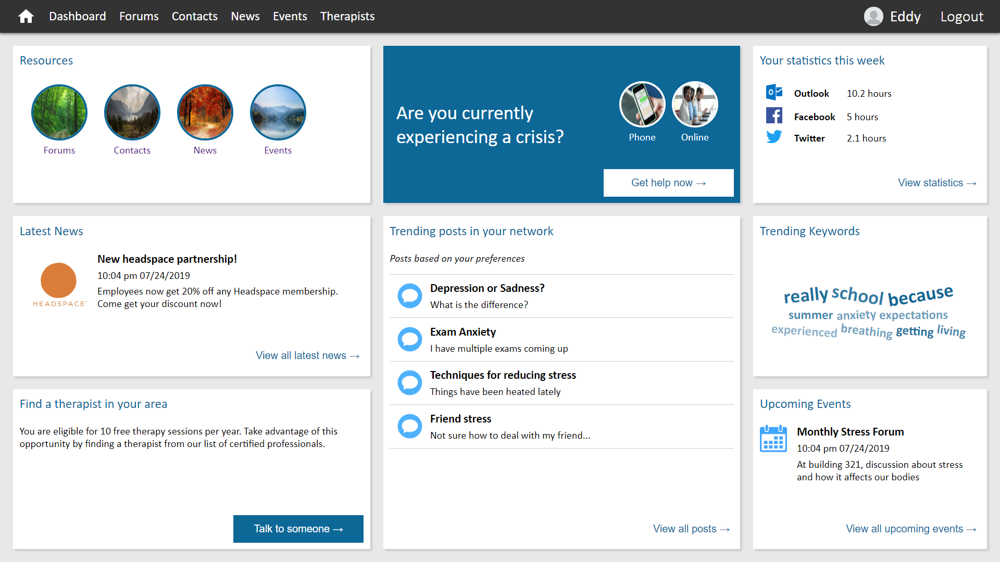
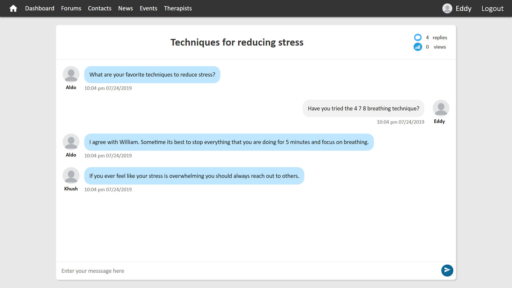
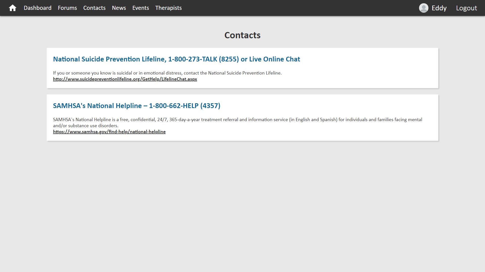
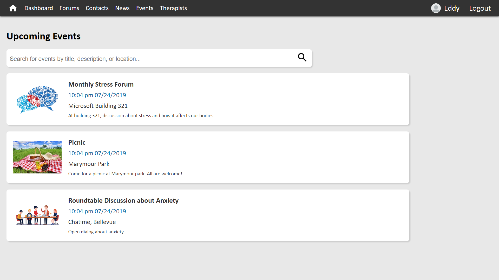
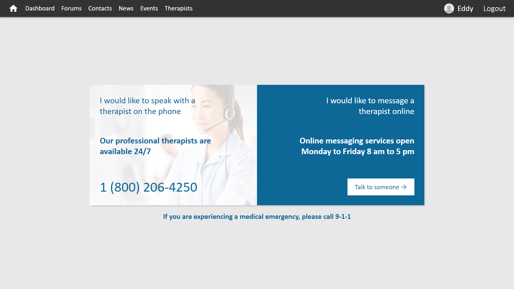

This project has adopted the [Microsoft Open Source Code of Conduct](https://opensource.microsoft.com/codeofconduct/). For more information see the [Code of Conduct FAQ](https://opensource.microsoft.com/codeofconduct/faq/) or contact [opencode@microsoft.com](mailto:opencode@microsoft.com) with any additional questions or comments.

# Project Setup

To set up and run the application, please follow the procedures outlined in the following subsections:

## Cloning the project

1. Clone the repository to your local machine:

   ```
   git clone https://github.com/Microsoft/MentalHealthPlatform.git
   ```

## Setting up the database

1.  Download and install MongoDB from the MongoDB website:
  
    https://docs.mongodb.com/manual/installation/

2. If using a Windows machine, one may need to add mongo to the environment variables. The instructions regarding the addition of environment variables can be found in the Microsoft Docs article for installing and configuring MongoDB:

    https://docs.microsoft.com/en-us/azure/virtual-machines/windows/install-mongodb

3.  After installing MongoDB, launch the MongoDB terminal by using the following command:
  
    ```
    mongo
    ```

4.  To add sample data, enter the commands listed in the **"docs/database_ commands.txt"** file of this repository

## Setting up the server

1.  In the cloned project, navigate to the **server** directory:

    ```
    cd server
    ```

2.  Install the dependencies:

    ```
    npm install
    ```

3.  Run the server:

    ```
    node server.js
    ```
    
    The console should then print a statement about the server running on a certain port:

    > Server is running on Port 3000...

## Setting up the client

1.  In the cloned project, navigate to the **client** directory:

    ```
    cd client
    ```

2.  Install all dependencies:

    ```
    npm install
    ```

## Running the project

1.  Run the client:

    ```
    npm start
    ```

    The console should then print a statement with a URL in which the application is running.

    For example:

    > Project is running at http://localhost:8080/

2.  Launch the application in a web browser by navigating to the URL printed by the console

# Pages

## Dashboard (Home) Page



## Topics Page


## Forum Page


## Chat Page



## Contacts Page



## Events Page



## News Page


## Therapists Page


## Crisis Page

