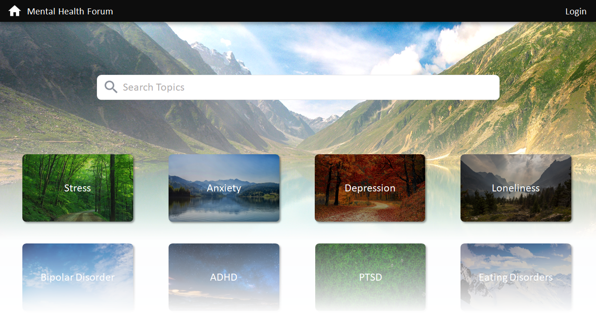
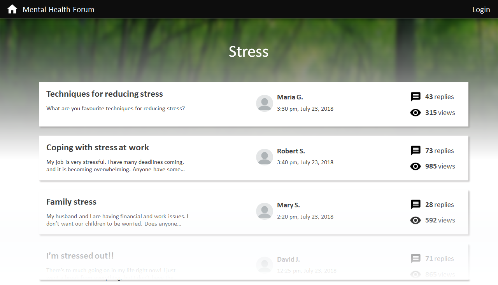
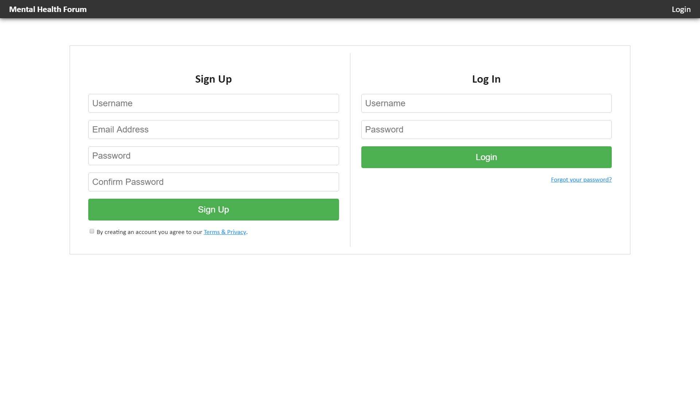

This project has adopted the [Microsoft Open Source Code of Conduct](https://opensource.microsoft.com/codeofconduct/). For more information see the [Code of Conduct FAQ](https://opensource.microsoft.com/codeofconduct/faq/) or contact [opencode@microsoft.com](mailto:opencode@microsoft.com) with any additional questions or comments.

# Project Setup

1. Clone the repository to your local machine:

   ```
   git clone https://github.com/Microsoft/MentalHealthPlatform.git
   ```

2. Navigate into the cloned project directory:

   ```
   cd website
   ```

3. Install all dependencies:

   ```
   npm install
   ```

4. Run the project:

   ```
   npm start
   ```

   The console should then print a statement with a URL in which the application is running.

   For example:

   > Project is running at http://localhost:8080/

5. Launch the application in a web browser by navigating to the URL printed by the console

# Pages

## Topics Page

The Topics page will act as the home page of the application.

This page will consist of a search header and topics grid. The topics grid will list a variety of mental health topics (ex. stress, anxiety, depression). When the user clicks on a topic, they will be directed to a Forum page for that topic.

The Topics component hierarchy can be found in [Component Hierarchies](./WebClient/docs/COMPONENT_HIERARCHIES.md).

The Topics page should be reachable via direct URL or by the user clicking on the application title link in the global navigation bar.



## Forum Page

The Forum page will display a table of chats relevant to the topic of the forum. When the user clicks on a chat, they will be directed to a Chat page.

The Forum component hierarchy can be found in [Component Hierarchies](./WebClient/docs/COMPONENT_HIERARCHIES.md).

The Forum page should be reachable via direct URL or by the user clicking on a Forum link within the topics table in the Topics page.



## Chat Page

The Chat page will display a table of posts relevant to the chat.

The Chat component hierarchy can be found in [Component Hierarchies](./docs/COMPONENT_HIERARCHIES.md).

The Chat page should be reachable via direct URL or by the user clicking on a Chat link within the forum table in the Forum page.


## Signup/Login Page

The Signup/Login page will display two panes: a Signup page, and a Login pane.

The Signup/Login page should be reachable via direct URL or by the user clicking the Login link in the global navigation bar.


